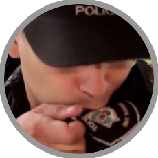

# Cobani

A bunch of simple scripts to run ML models against your own webcams.

## Requirements

Python 2.x, Cobani uses a bunch of libraries, to install them simply run:

```bash
pip install -r requirements.txt
```

Note you don't need all the libraries installed, for example only `--training` and `--predict` require tensorflow and tensorflow_hub.

## Usage

* Edit the `.cobani` file to reflect your setup. In my case I'm using the Nest cameras, so you'll need to enter your Nest “access token”.

* `python app.py --picamera --repeat 30`
  Will fetch images from the Raspberry Pi camera every 30 seconds, and stores them in a folder under `images/all/`.

* `python app.py --nest --repeat 30`
  Will fetch images (every 30 seconds) from all the Nest cameras associated with your Nest token that's entered in your `.cobani` settings file. Images are stored in a folder under `images/all/`.

* `python app.py --train`
  Will train a model based on the images found under `images/labeled/`.
  Simply place your own labeled images as subdirectories.

  For example:

  ```
  images/labeled/
    ├── door-packages
    │   ├── 1526751023.1088014.jpg
    │   ...
    ├── car
    │   ├── 1526751127.270875.jpg
    │   ...
    ├── mailman
    │   ├── 1526751127.270875.jpg
    │   ...
  ```

  Make sure to add at least a hundred or more images to be able to learn from them. Also try to have a similar number of images for all categories.

* `python app.py --predict --repeat 90`
  Runs the previously trained machine learning model with your own data. It will read all the camera sources available, run the model and store the results in the `predictions/` folder. This is heavy to run on a Raspberry Pi Zero so use the `--repeat` flag with at least 90 seconds between runs or more.

* `python app.py --slack`
  Starts a Slack bot that answers questions about your house. See the plugins section to extend it's capabilities.

  1.  To configure your slack bot go to `https://api.slack.com/bot-users`
  2.  Add the token to your `.cobani` file

- `python app.py --slack_changes --repeat 30`
  Tracks changes on the webcams by looking at the files stored on the `predictions/` folder. This is very cheap to run since it only looks at the files on disk.

> There's a convenience script called `start.sh` that runs all the commands at once. This is useful if you want to run that script when your Raspberry Pi boots.

---


